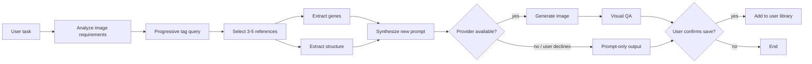

# /Grompt

#### A self-iterating prompt skill for image-generation agents


`/Grompt` turns a rough image task into a reference-backed prompt.

It reads a cold-start prompt corpus, finds 3-5 relevant examples, extracts reusable visual genes and prompt structure, writes a new task-specific prompt, and then either calls an available image-generation provider or returns prompt-only output when no provider is configured.

It is designed for any agent system that can load a skill folder and run local Python scripts.

---

## Why

Most image prompts fail in the same boring ways:

- the task is underspecified
- the style words are decorative but not operational
- the prompt has no structure
- the model invents text, layout, or hierarchy
- every new image starts from zero

`/Grompt` fixes that by treating prompting as retrieval plus synthesis:

1. classify the task
2. browse the prompt library by tags
3. select a few strong references
4. extract genes and structure
5. write a new prompt for this task
6. optionally generate the image
7. ask whether the final result should become a new reference

The skill improves over time because user-approved outputs can be added back into a local reference library.

---

## What It Contains

- `SKILL.md` - agent-facing workflow
- `agents/openai.yaml` - OpenAI/Codex UI metadata
- `references/prompt_cases.json` - 503 cold-start prompt cases
- `references/templates.json` - categories, styles, scenes, and templates
- `references/index.md` - compact corpus summary
- `scripts/synthesize_prompt.py` - task analysis, retrieval, gene extraction, prompt synthesis
- `scripts/library_query.py` - progressive tag browsing
- `scripts/library_add.py` - add user-confirmed prompts to the local library
- `scripts/install_check.py` - provider/tooling probe
- `tests/` - regression tests for portability, naming, retrieval, provider fallback, and self-iteration

Runtime self-iteration data is written to:

```text
references/user_prompt_library.json
```

That file is ignored by git by default.

---

## Install

Put the `grompt/` folder under any agent or system skill root.

Examples:

```bash
# Any agent/system skill root works.
mkdir -p ~/.agents/skills
cp -R grompt ~/.agents/skills/grompt
```

Set `GROMPT_DIR` to the installed folder before running helper scripts:

```bash
export GROMPT_DIR="/absolute/path/to/skills/grompt"
```

The skill itself does not require Codex-specific paths. It works in any environment that can:

- read `SKILL.md`
- run Python scripts
- optionally call an image-generation provider

---

## Quick Start

Check provider availability:

```bash
python "$GROMPT_DIR/scripts/install_check.py"
```

Synthesize a prompt:

```bash
python "$GROMPT_DIR/scripts/synthesize_prompt.py" \
  --task "做一张城市生命系统信息图，要求信息结构清楚，中文标签可读，竖版" \
  --count 5 \
  --format markdown
```

Browse the library progressively:

```bash
python "$GROMPT_DIR/scripts/library_query.py" --level types
python "$GROMPT_DIR/scripts/library_query.py" --level tags --tag-type category
python "$GROMPT_DIR/scripts/library_query.py" \
  --level prompts \
  --tag-type category \
  --tag "Charts & Infographics" \
  --limit 5
```

Add a user-confirmed prompt:

```bash
python "$GROMPT_DIR/scripts/library_add.py" \
  --title "夜航计划音乐节海报" \
  --prompt "$FINAL_PROMPT" \
  --category "Posters & Typography" \
  --style "Poster" \
  --scene "Music" \
  --task "做一张赛博朋克音乐节海报" \
  --source "user-confirmed"
```

---

## Agent Workflow



---

## Progressive Disclosure

Agents should not load the entire prompt corpus first.

`/Grompt` exposes the library in layers:

1. tag types: `category`, `style`, `scene`, `source`
2. tags under selected types
3. prompt excerpts under selected tags
4. full prompt data only when needed

This keeps context use low and helps the agent compare references before copying anything.

---

## Provider Behavior

`/Grompt` prefers GPT Image 2 or a GPT Image 2-compatible provider because the corpus is built around GPT Image 2 prompt behavior.

If no provider is configured:

1. the agent should ask the user for provider details
2. it should recommend GPT Image 2
3. if the user declines, it should continue in prompt-only mode

Prompt-only mode is a valid completion path.

---

## Verify

```bash
python3 -m unittest discover -s tests -v
```

Expected result:

```text
Ran 7 tests
OK
```

If you have the local skill validator available:

```bash
python3 /path/to/skill-creator/scripts/quick_validate.py /absolute/path/to/grompt
```

---

## Data Notes

The cold-start corpus was generated from `freestylefly/awesome-gpt-image-2` at commit:

```text
5ffa75c6e22e804b54a462841dc3d7035d8584ed
```

Observed source facts during packaging:

- shallow clone size: `292M`
- `.git` size: `141M`
- cloned checkout files: `621`
- indexed prompt cases: `503`
- image folder case images: `506`
- generated prompt data missing case IDs: `12`, `169`, `170`

---

## Acknowledgements

Huge thanks to [`freestylefly/awesome-gpt-image-2`](https://github.com/freestylefly/awesome-gpt-image-2).

That project provides the cold-start prompt database for `/Grompt`: the initial case corpus, categories, styles, scenes, and template references that make the skill useful before it has any user-confirmed local examples.

`/Grompt` is a downstream agent workflow and retrieval/synthesis layer built on top of that public prompt library. It keeps the upstream corpus immutable and stores user-approved additions separately.

---

## License

MIT. See [LICENSE](LICENSE).
